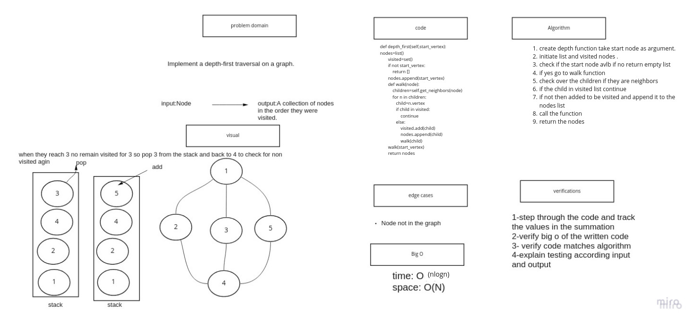

# Graphs

A graph is a non-linear data structure that can be looked at as a collection of vertices (or nodes) potentially connected by line segments named edges.

## Challenge

Implement your own Graph. The graph should be represented as an adjacency list, and should include the following methods:

## Approach & Efficiency

 time:o(1)    space:o(1)

## API

    add node
        Arguments: value
        Returns: The added node
        Add a node to the graph
    add edge
        Arguments: 2 nodes to be connected by the edge, weight (optional)
        Returns: nothing
        Adds a new edge between two nodes in the graph
        If specified, assign a weight to the edge
        Both nodes should already be in the Graph
    get nodes
        Arguments: none
        Returns all of the nodes in the graph as a collection (set, list, or similar)
    get neighbors
        Arguments: node
        Returns a collection of edges connected to the given node
            Include the weight of the connection in the returned collection
    size
        Arguments: none
        Returns the total number of nodes in the graph

# lab 36:Code Challenge:graph-breadth-first

## Whiteboard Process

## Approach & Efficiency

 time:o(n)    space:o(n)

## Solution

    def breadth_first(self,vertex1,action=(lambda x:None)):
        nodes=list()
        breadth=Queue()
        visited=set()

        breadth.enqueue(vertex1)
        visited.add(vertex1)

        while breadth:
            front=breadth.dequeue()
            action(front)
            # nodes.add(front)
            children=self.get_neighbors(front)
            for n in children:
               child=n.vertex
               if child is not visited:
                   visited.add(child)
                   breadth.enqueue(child)
        return nodes

## Requirements

The implementation uses adjacency list representation of graphs. list container is used to store lists of adjacent nodes and queue of nodes needed for BFS traversal.

# Depth first preorder traversal on a graph

Write the following method for the Graph class:

    depth first
    Arguments: Node (Starting point of search)
    Return: A collection of nodes in their pre-order depth-first traversal order
    Display the collection

## Whiteboard Process

## Approach & Efficiency

Time: O(nlogn) Space: O(N)

## Solution

 def depth_first(self,start_vertex):
        nodes=list()
        visited=set()
        if not start_vertex:
            return []
        nodes.append(start_vertex)
        def walk(node):
            children=self.get_neighbors(node)
            for n in children:
               child=n.vertex
               if child in visited:
                   continue
               else:
                   visited.add(child)
                   nodes.append(child)
                   walk(child)
        walk(start_vertex)
        return nodes
