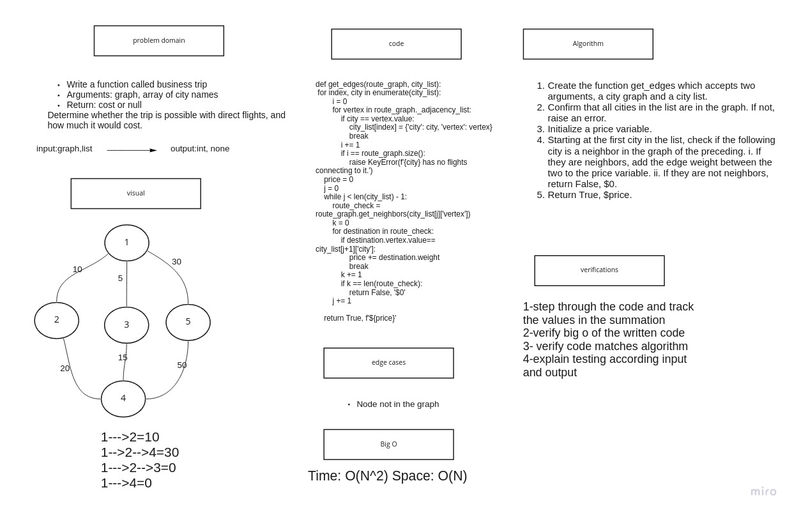

# Challenge Summary

Write a function called business trip

    Arguments: graph, array of city names
    Return: cost or null

Determine whether the trip is possible with direct flights, and how much it would cost.

## Whiteboard Process

## Approach & Efficiency

Time: O(N^2) Space: O(N)

## Solution

def get_edges(route_graph, city_list):
    for index, city in enumerate(city_list):
        i = 0
        for vertex in route_graph._adjacency_list:
            if city == vertex.value:
                city_list[index] = {'city': city, 'vertex': vertex}
                break
            i += 1
            if i == route_graph.size():
                raise KeyError(f'{city} has no flights connecting to it.')
    price = 0
    j = 0
    while j < len(city_list) - 1:
        route_check = route_graph.get_neighbors(city_list[j]['vertex'])
        k = 0
        for destination in route_check:
            if destination.vertex.value== city_list[j+1]['city']:
                price += destination.weight
                break
            k += 1
            if k == len(route_check):
                return False, '$0'
        j += 1

    return True, f'${price}'
