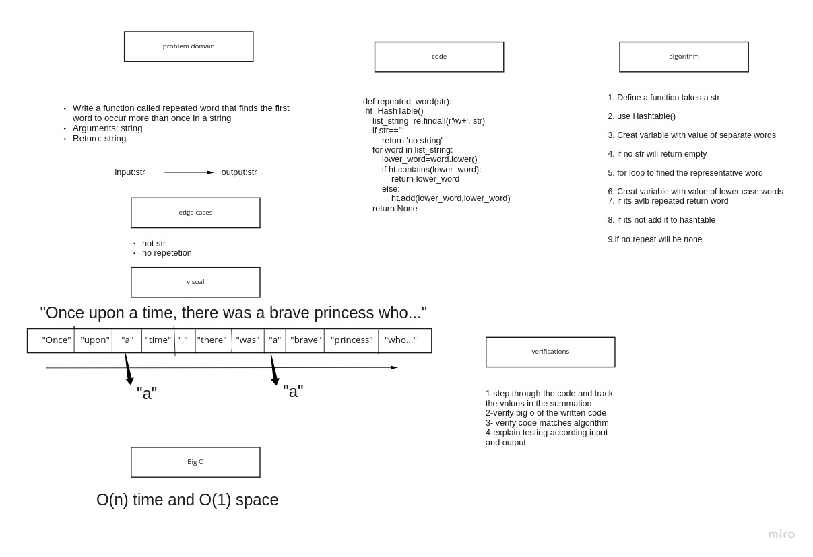

# Hashmap repeated word

    Write a function called repeated word that finds the first word to occur more than once in a string
    Arguments: string
    Return: string


## Whiteboard Process



## Approach & Efficiency
BigO:

Time:O(n)

Space:O(1)

## Solution

```
def repeated_word(str):
    ht=HashTable()
    list_string=re.findall(r'\w+', str)
    if str=='':
        return 'no string'
    for word in list_string:
        lower_word=word.lower()
        if ht.contains(lower_word):
            return lower_word
        else:
            ht.add(lower_word,lower_word)
    return None

```
