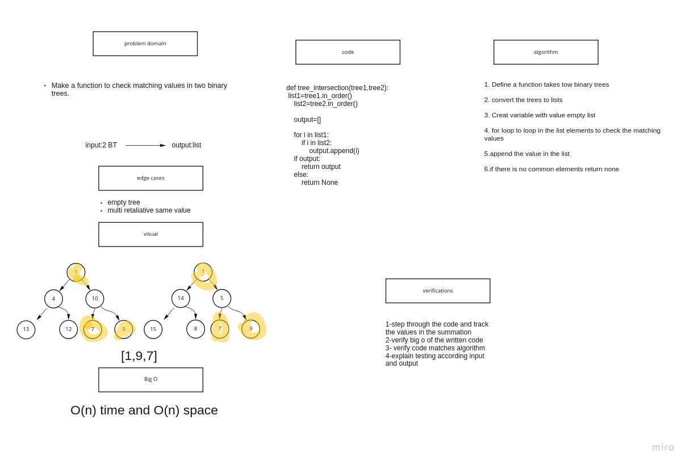

# Hashmap tree intersection


Write a function called tree_intersection that takes two binary tree parameters. Without utilizing any of the built-in library methods available to your language, return a set of values found in both trees.


## Whiteboard Process



## Approach & Efficiency
BigO:

Time:O(n)

Space:O(n)

## Solution

```
def tree_intersection(tree1,tree2):
    list1=tree1.in_order()
    list2=tree2.in_order()

    output=[]

    for i in list1:
        if i in list2:
            output.append(i)
    if output:
        return output
    else:
        return None

```
