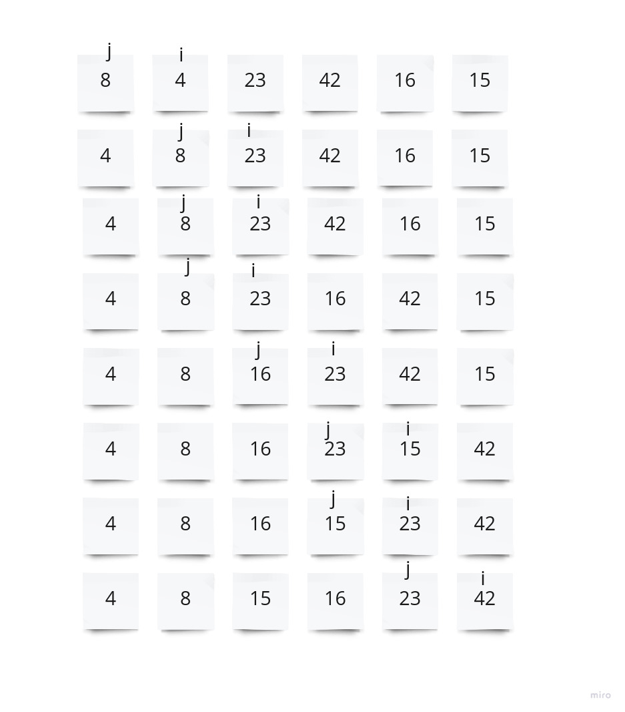

# Insertion Sort

## promblem Domain:

Write Blog about insertion sort, using the pseudocode that provided.

## Pseudocode

    InsertionSort(int[] arr)

        FOR i = 1 to arr.length

        int j <-- i - 1
        int temp <-- arr[i]

        WHILE j >= 0 AND temp < arr[j]
            arr[j + 1] <-- arr[j]
            j <-- j - 1

        arr[j + 1] <-- temp


## Algorithm

1. Define a function takes a list of integers

2. Start a fo loop that loop throught the array starting at index 1 and going the length of the array.

3. Creat variable (j) with value 1.

4. Creat a temporary variable (temp)  and assign the value of the array at index (i).

5. Creat a while loop that keep run while (j) is greater or equal to 0 And the temp is less than the array at index (j).

6. temp is less than array at index(j) and moves 1 index to the right to sort the array.

7. Decreaments (j) by 1.

8. Assign temp at index (j+1)

9. Continues till go through whole array.


## Trace

Sample Array: [8,4,23,42,16,15]

## Visual



## Code

```
def insertion_sort(list):

    for i in range(1,len(list)):
        j=i-1
        temp=list[i]

        while j>=0 and temp<list[j]:
            list[j+1]=list[j]
            j=j-1
        list[j+1]=temp
    return list

if __name__=='__main__':
    unsort_list=[8,4,23,42,16,15]
    print(insertion_sort(unsort_list))


```

## Tests

```
import pytest
from insertion_sort import insertion_sort

@ pytest.mark.parametrize(
    "test_list,expected",[
    ([8,4,23,42,16,15],[4, 8, 15, 16, 23, 42]),

    ([20,18,12,8,5,-2],[-2, 5, 8, 12, 18, 20] ),
    ([5,12,7,5,5,7],[5, 5, 5, 7, 7, 12]),
    ([2,3,5,7,13,11],[2, 3, 5, 7, 11, 13] )
    ])

def test_insertion_sort(test_list,expected):
    actual=insertion_sort(test_list)
    assert actual==expected
```

## Big O

TIME:O(N^2)
Space:O(1)
