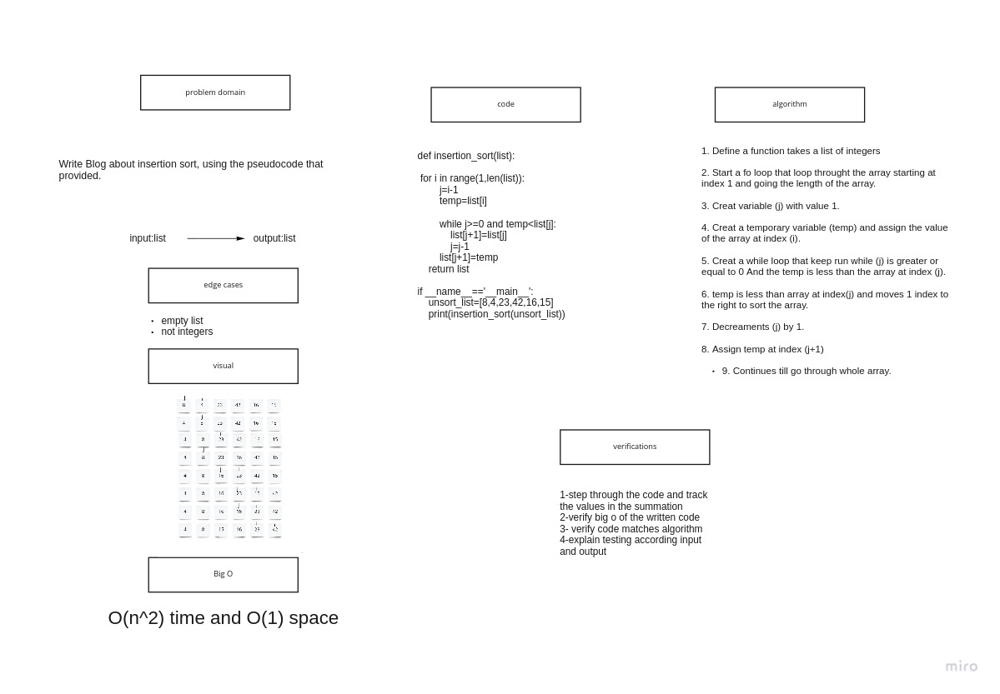

# Insertion Sort

# Challenge Summary

Write Blog about insertion sort, using the pseudocode that provided.


## Approach & Efficiency

TIME:O(N^2)
Space:O(1)

## Whiteboard Process



## Solution

```

def insertion_sort(list):

    for i in range(1,len(list)):
        j=i-1
        temp=list[i]

        while j>=0 and temp<list[j]:
            list[j+1]=list[j]
            j=j-1
        list[j+1]=temp
    return list

if __name__=='__main__':
    unsort_list=[8,4,23,42,16,15]
    print(insertion_sort(unsort_list))
```
