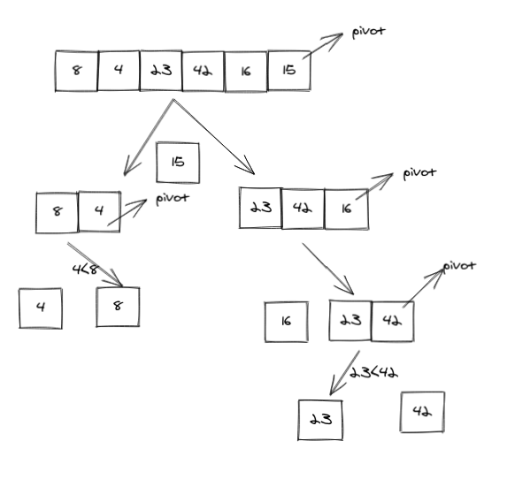

# Quick Sort

## promblem Domain:

Quick Sort is a Divide and Conquer algorithm. It divides the input array into two halves, calls itself for the two halves, and then merges the two sorted halves.

## Pseudocode

```
def quick_sort(arr, left, right):
    if left < right:
        position=partition(arr, left, right)
        quick_sort(arr, left, position - 1)
        quick_sort(arr, position + 1, right)

def partition(arr, left, right):
    pivot=arr[right]
    low =left - 1
    for i in range (left ,right):
        if arr[i] <= pivot:
            low=low+1
            swap(arr, i, low)

    swap(arr, right, low + 1)
    return (low + 1)

def swap(arr, i, low):
    temp=arr[i]
    arr[i]=arr[low]
    arr[low]=temp

array = [ 8,4,23,42,16,15 ]
quick_sort(array, 0, len(array)-1)

print(f'Sorted array: {array}')
```
## Algorithm

1. Creat a function quick_sort take 3 params(array,starting index,ending index)

2. position index is partitioning index (correct place in sorted array)

3. quick sort for elements before position index

4. quick sort for elements after position index

5. Creat function called partition take 3 params(array,starting index,ending index)

6. Declare pivot that element at right most position.

7. Declare low the index of smaller element

8. if current element is smaller than the pivot , swap the element with pivot.

9. return increment index of smaller element

10. (swap function to do elements swap)

## Trace

Sample Array: [8,4,23,42,16,15]



## Code

```
def quick_sort(arr, left, right):
    if left < right:
        position=partition(arr, left, right)
        quick_sort(arr, left, position - 1)
        quick_sort(arr, position + 1, right)

def partition(arr, left, right):
    pivot=arr[right]
    low =left - 1
    for i in range (left ,right):
        if arr[i] <= pivot:
            low=low+1
            swap(arr, i, low)

    swap(arr, right, low + 1)
    return (low + 1)

def swap(arr, i, low):
    temp=arr[i]
    arr[i]=arr[low]
    arr[low]=temp

array = [ 8,4,23,42,16,15 ]
quick_sort(array, 0, len(array)-1)

print(f'Sorted array: {array}')
```

## Tests

```
import pytest
from quick_sort import quick_sort

@ pytest.mark.parametrize(
    "test_list,expected",[
    ([8,4,23,42,16,15],[4, 8, 15, 16, 23, 42]),

    ([20,18,12,8,5,-2],[-2, 5, 8, 12, 18, 20] ),
    ([5,12,7,5,5,7],[5, 5, 5, 7, 7, 12]),
    ([2,3,5,7,13,11],[2, 3, 5, 7, 11, 13] )
    ])

def test_quick_sort(test_list,expected):
    result=test_list
    actual=quick_sort(result,0,len(result)-1)
    assert result==expected

```

## Big O

Time: O(n*log_n)
Space:O(n)
