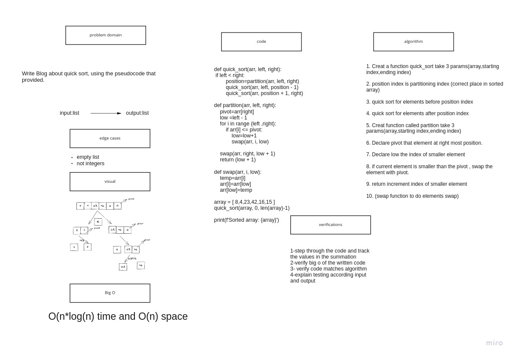

# Merge Sort

# Challenge Summary

Write Blog about Quick sort, using the pseudocode that provided.


## Approach & Efficiency

TIME:O(n*logn))
Space:O(n)

## Whiteboard Process



## Solution

```
def quick_sort(arr, left, right):
    if left < right:
        position=partition(arr, left, right)
        quick_sort(arr, left, position - 1)
        quick_sort(arr, position + 1, right)

def partition(arr, left, right):
    pivot=arr[right]
    low =left - 1
    for i in range (left ,right):
        if arr[i] <= pivot:
            low=low+1
            swap(arr, i, low)

    swap(arr, right, low + 1)
    return (low + 1)

def swap(arr, i, low):
    temp=arr[i]
    arr[i]=arr[low]
    arr[low]=temp

array = [ 8,4,23,42,16,15 ]
quick_sort(array, 0, len(array)-1)

print(f'Sorted array: {array}')

```
