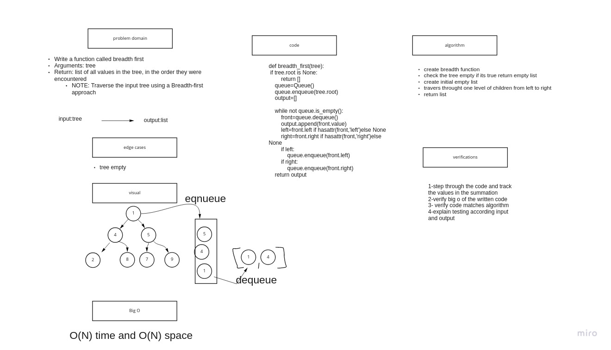

# Stacks and Queues

## Challenge

Implement a stack and queue data structure using linked list

## Approach & Efficiency

Big O : Time: O(1) for all methods

# [code](stack_and_queue.py)

# [tests](test_stack_and_queue.py)

# Breadth-first Traversal.

## Challenge

Implement Breadth-first Traversal on binary tree and get output of list.

## Approach & Efficiency

Big O : Time: O(N) Space: O(N)

# [code](stack_and_queue.py)

# [tests](test_stack_and_queue.py)

## Whitboard:

