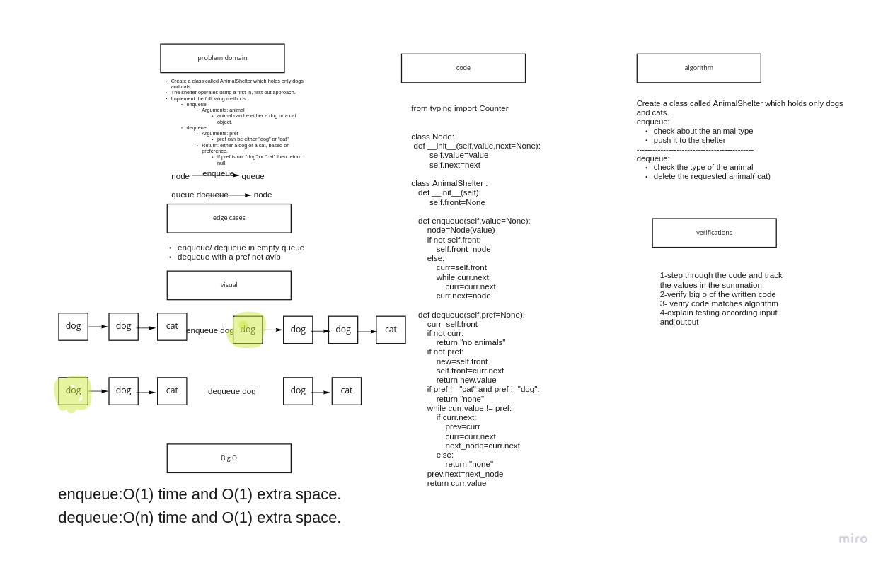

# pseudoqueues:

## Challenge

    Create a class called AnimalShelter which holds only dogs and cats.
    The shelter operates using a first-in, first-out approach.
    Implement the following methods:

        enqueue

            Arguments: animal

                animal can be either a dog or a cat object.
        dequeue

            Arguments: pref

                pref can be either "dog" or "cat"

            Return: either a dog or a cat, based on preference.

                If pref is not "dog" or "cat" then return null.

## Approach & Efficiency

Big O :
enqueue:

 Time: O(1)

space: O(1)

dequeue:

 Time: O(2)

space: O(1)

# [code](stack_queue_animal_shelter.py)

# [tests](stack_queue_animal_shelter.py)

