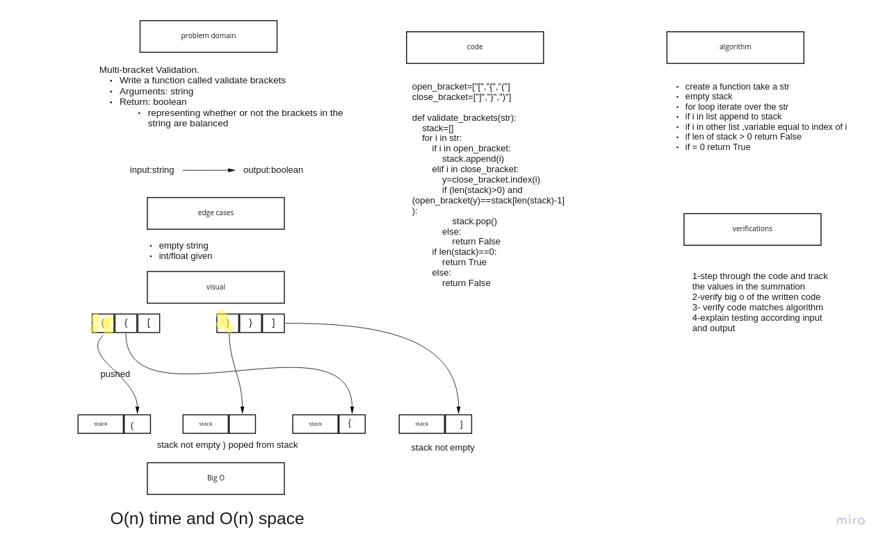

# pseudoqueues:

## Challenge

Multi-bracket Validation.

Write a function called validate brackets

Arguments: string

Return: boolean

representing whether or not the brackets in the string are balanced

## Approach & Efficiency

Big O : Time: O(n)
space: O(n)

# [code](stack_queue_brackets.py)

# [tests](test_stack_queue_brackets.py)

