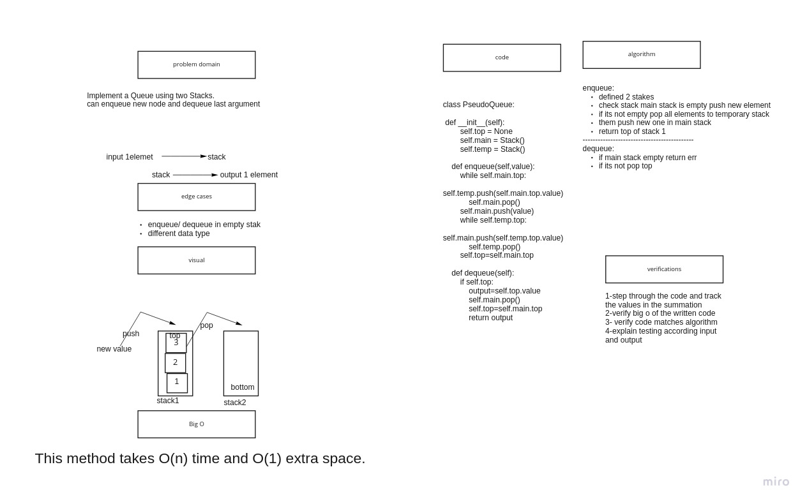

# pseudoqueues:

## Challenge

Implement a Queue using two Stacks.

## Approach & Efficiency

Big O : Time: O(n)
space: O(1)

# [code](stack_queue_pseudo.py)

# [tests](test_stack_queue_pseudo.py)

