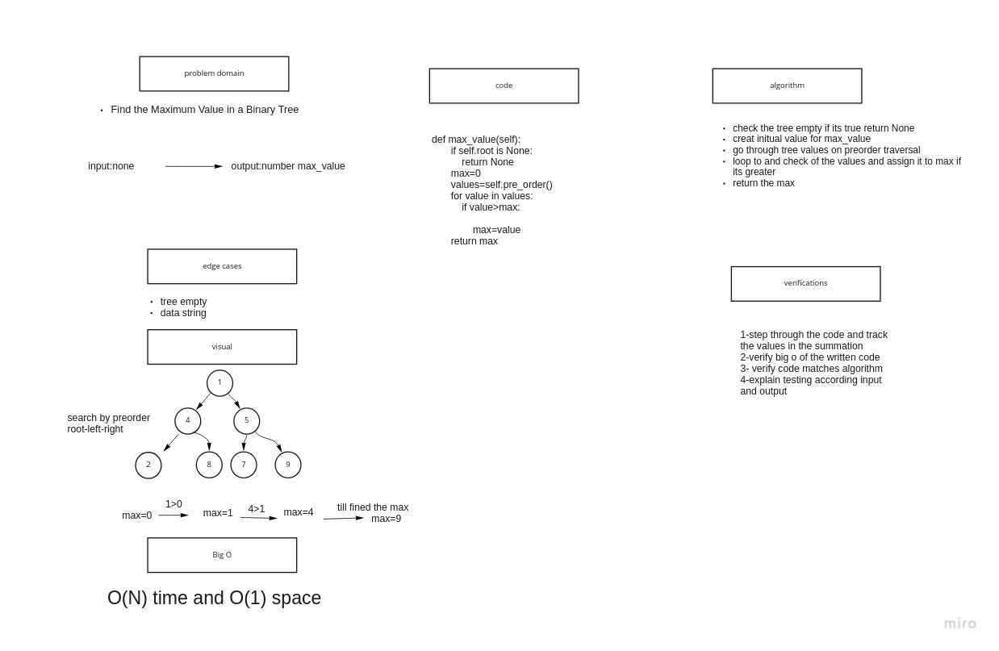

# Trees


## Challenge

* Node

    Create a Node class that has properties for the value stored in the node, the left child node, and the right child node.

* Binary Tree

    Create a Binary Tree class
        Define a method for each of the depth first traversals:
            pre order
            in order
            post order which returns an array of the values, ordered appropriately.

* Binary Search Tree

## Approach & Efficiency

* Binary Tree

Time: O(N)
Space:O(1)

* Binary Search Tree

Time: O(log(N))
Space:O(1)

## API


* Add

    Arguments: value
    Return: nothing
    Adds a new node with that value in the correct location in the binary search tree.


* Contains

    Argument: value
    Returns: boolean indicating whether or not the value is in the tree at least once.

## max Tree:

# Challenge Summary

Write the following method for the Binary Tree class

    find maximum value

        Arguments: none

        Returns: number

Find the maximum value stored in the tree. You can assume that the values stored in the Binary Tree will be numeric.

## Whiteboard Process



## Approach & Efficiency


time : O(N)
space: O(1)

## Solution

check over the tree values and return the max value

```
   tree=BinaryTree(Node())
    tree.root=Node(1)
    tree.root.left=Node(5)
    tree.root.right=Node(4)
    tree.root.left.left=Node(3)
    tree.root.right.right=Node(2)
    actual=tree.max_value()
    expected=5
    assert actual== expected
```
