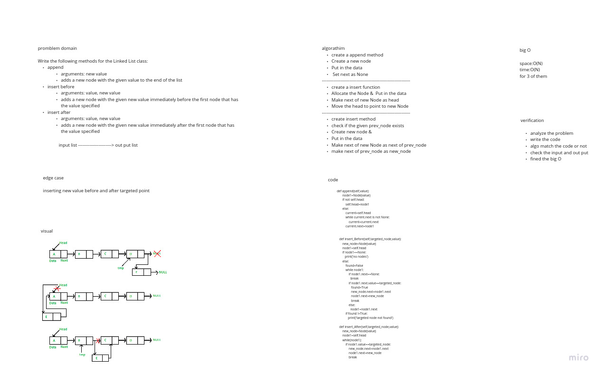

# Singly Linked List

A singly linked list is a type of linked list that is unidirectional, that is, it can be traversed in only one direction from head to the last node (tail).

## Challenge

it was hard to deal with 2 classes , but in general  was good

## Approach & Efficiency

O(n)
for str function

## API
<!-- Description of each method publicly available to your Linked List -->

# code challenge  6:

# Challenge Summary

Write the following methods for the Linked List class:

    append
        arguments: new value
        adds a new node with the given value to the end of the list
    insert before
        arguments: value, new value
        adds a new node with the given new value immediately before the first node that has the value specified
    insert after
        arguments: value, new value
        adds a new node with the given new value immediately after the first node that has the value specified

## Whiteboard Process

## Approach & Efficiency

insert , append,,,,takes any value as an argument and adds a new node with a O(1)time performance ,,, (ps:ignore the one on the white board its not O(N))

